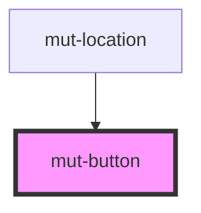

# mut-button

<!-- Auto Generated Below -->

## Properties

| Property   | Attribute  | Description | Type                     | Default     |
| ---------- | ---------- | ----------- | ------------------------ | ----------- |
| `disabled` | `disabled` |             | `boolean`                | `false`     |
| `type`     | `type`     |             | `"default" \| "primary"` | `undefined` |

## Dependencies

### Used by

 - [mut-location](../mut-location)

### Graph

----------------------------------------------

*Built with [StencilJS](https://stenciljs.com/)*
