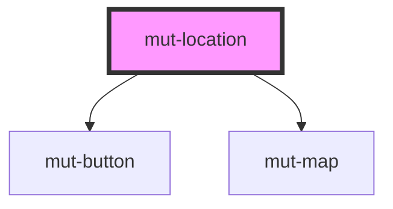

# mut-location

<!-- Auto Generated Below -->

## Properties

| Property      | Attribute     | Description | Type     | Default      |
| ------------- | ------------- | ----------- | -------- | ------------ |
| `buttonType`  | `button-type` |             | `any`    | `undefined`  |
| `placeholder` | `placeholder` |             | `string` | `'Location'` |
| `value`       | `value`       |             | `string` | `''`         |

## Events

| Event       | Description | Type               |
| ----------- | ----------- | ------------------ |
| `mutChange` |             | `CustomEvent<any>` |

## Dependencies

### Depends on

- [mut-button](../mut-button)
- [mut-map](../mut-map)

### Graph

----------------------------------------------

*Built with [StencilJS](https://stenciljs.com/)*
