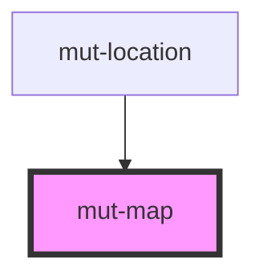

# mut-map

<!-- Auto Generated Below -->

## Properties

| Property   | Attribute   | Description | Type     | Default |
| ---------- | ----------- | ----------- | -------- | ------- |
| `id`       | `id`        |             | `string` | `''`    |
| `lngLat`   | --          |             | `any[]`  | `[]`    |
| `searchId` | `search-id` |             | `string` | `''`    |

## Dependencies

### Used by

 - [mut-location](../mut-location)

### Graph

----------------------------------------------

*Built with [StencilJS](https://stenciljs.com/)*
